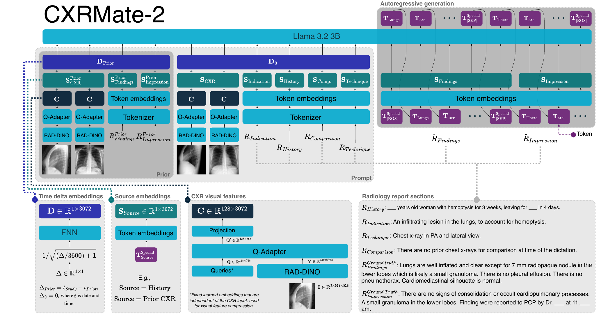

# CXRMate-2

This repository provides the code to train the CXRMate-2 model.

```
Citation
```



## Download model
The model is available on Hugging Face Hub: https://huggingface.co/aehrc/cxrmate-2

```python
alias = 'aehrc/cxrmate-2'

model = transformers.AutoModelForCausalLM.from_pretrained(alias, trust_remote_code=True).to(device='cuda')
model.eval()
generation_config = transformers.GenerationConfig.from_pretrained(alias, trust_remote_code=True)
processor = transformers.AutoProcessor.from_pretrained(alias, trust_remote_code=True)
```

## Generation
```python
url = 'https://prod-images-static.radiopaedia.org/images/220869/76052f7902246ff862f52f5d3cd9cd_big_gallery.jpg'
processed = processor(images=url)
processed = processed.to(device='cuda')
generated_ids = model.generate(**processed, generation_config=generation_config)
findings, impression = processor.split_and_decode_sections(generated_ids) 
```

## Generated reports

CXRMate-2 generated reports:
[MIMIC-CXR - test set](generated_reports/cxrmate2_generated_reports_mimic_cxr_test.csv)
[CheXpert Plus - valid set](generated_reports/cxrmate2_generated_reports_chexpert_plus_valid.csv)
[ReXgradient - test set](generated_reports/cxrmate2_generated_reports_rexgradient_test.csv)

## Environment

Requirements for the environment are in `requirements.txt`

# Training
## Download datasets

MIMIC-CXR and MIMIC-CXR-JPG must be in the same Physio Net directory. E.g.:

```shell
user@cluster:~$ ls /home/user/physionet.org/files
mimic-cxr  mimic-cxr-jpg  mimic-iv-ed
```

Download the MIMIC-CXR-JPG dataset from https://physionet.org/content/mimic-cxr-jpg, e.g.,
```shell
wget -r -N -c -np --user <username> --ask-password https://physionet.org/files/mimic-cxr-jpg/2.1.0/
```

MIMIC-CXR-JPG does not include the radiology reports and are instead included with MIMIC-CXR (the DICOM version of the dataset). To download this dataset and avoid downloading the DICOM files (which are very large), use `--reject dcm` with the wget command from https://physionet.org/content/mimic-cxr, e.g, 
```shell
wget -r -N -c -np --reject dcm --user <username> --ask-password https://physionet.org/files/mimic-cxr/2.0.0/
```
Note that you must be a credentialised user to access MIMIC-CXR/MIMIC-CXR-JPG.

CheXpert Plus can be downloaded from: https://aimi.stanford.edu/datasets/chexpert-plus.

## Prepare datasets:

The following scripts prepare each dataset into a HuggingFace `DatasetDict` saved to `database_dir`. Each script accepts `--database_dir` (default: `database`) and `--num_workers` (default: `4`).

### MIMIC-CXR-JPG:
```shell
python prepare_datasets/prepare_mimic_cxr_jpg.py --physionet_dir <physionet_dir>
```

### CheXpert Plus:
```shell
python prepare_datasets/prepare_chexpert_plus.py --chexpert_plus_dir <chexpert_plus_dir>
```

### ReXGradient-160K:
```shell
python prepare_datasets/prepare_rexgradient.py
```
Note that this script also downloads https://huggingface.co/datasets/rajpurkarlab/ReXGradient-160K.

## Training

First train the SFT model:
```shell
accelerate launch utils.py -t cxrmate2 -c config/sft_public.yaml
```
